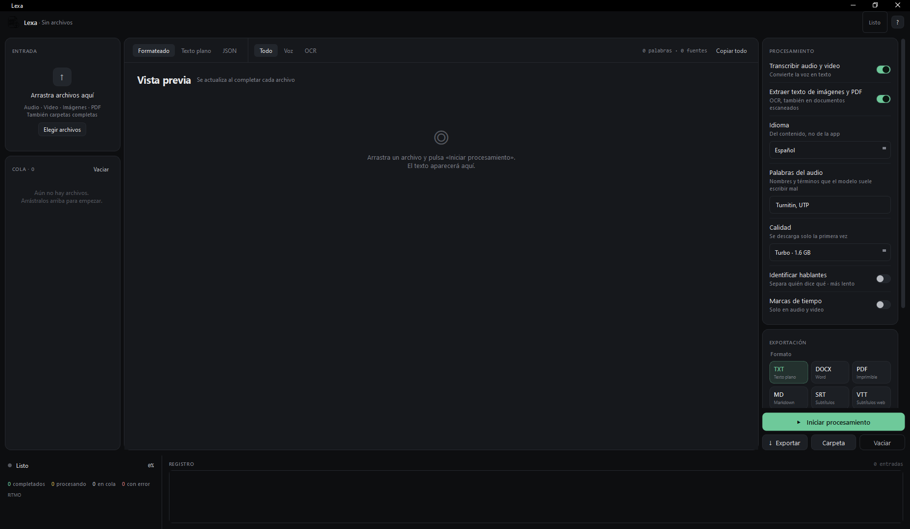
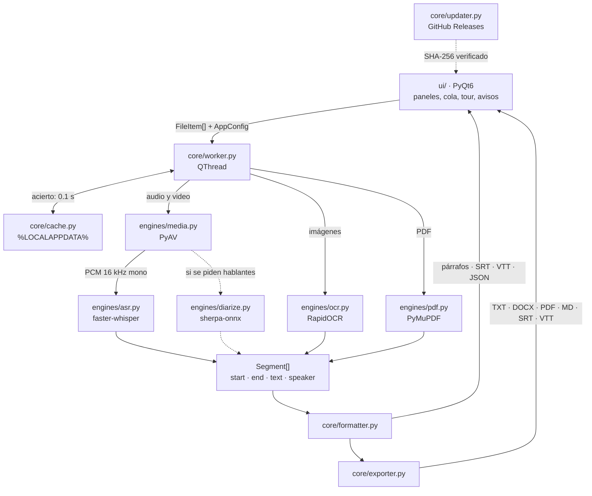

<div align="center">


# Lexa

**Convierte audio, video, imágenes y PDFs en texto. Todo en tu computadora.**

<p>


</p>
<p>


</p>

Sin cuentas, sin API keys, sin subir nada a internet.



</div>

---

## Qué hace

| Entrada | Qué obtienes |
|---|---|
| **Audio** — mp3, wav, m4a, ogg, flac, aac, opus, wma | Transcripción con puntuación, agrupada en párrafos |
| **Video** — mp4, mkv, avi, mov, webm | Lo mismo, extrayendo la pista de audio |
| **Imágenes** — jpg, png, webp, tiff | Texto reconocido con OCR, respetando el orden de lectura |
| **PDF** — nativos y escaneados | Texto embebido cuando existe; OCR página a página cuando la letra es una imagen |

Además:

- **Diccionario de términos** — escribe los nombres y palabras que el modelo suele
  escribir mal (apellidos, marcas, jerga) y los acierta.
- **Identificación de hablantes** — separa quién dice qué en una conversación.
- **Aguanta grabaciones malas** — micrófono lejano, sala con eco, volumen bajo.
- **Caché de resultados** — volver a soltar un archivo ya procesado con los mismos
  ajustes lo devuelve al instante.
- **El resultado se guarda junto al archivo original**, que es donde lo busca
  quien acaba de arrastrar un audio. Se puede elegir otra carpeta.
- **Exporta a TXT, Word, PDF, Markdown, SRT y VTT.**
- **Se actualiza sola** desde GitHub Releases, verificando el SHA-256.
- **Arrastra una carpeta entera** y procesa todo lo que haya dentro.

## Arquitectura



Cuatro motores distintos detrás de una cola común. **Ninguno conoce Qt**: todos
devuelven `Segment[]` y el worker es el único puente con la interfaz.
`formatter.py` es el único módulo que decide cómo se ve el texto final, así que
una transcripción y un OCR producen la misma estructura de salida.

## Instalación

### El ejecutable (recomendado para usar)

Descarga el zip de la [última Release](https://github.com/LOAD-13/Lexa/releases/latest),
descomprime la carpeta completa y ejecuta `Lexa.exe`. No requiere Python ni
instalar nada.

Verifica la descarga contra el `SHA256SUMS.txt` de la Release:

```powershell
Get-FileHash .\Lexa-1.3.3-windows-x64.zip -Algorithm SHA256
```

A partir de la 1.3.3, Lexa comprueba al arrancar si hay versión nueva y la
instala desde la propia app.

### Desde el código (para desarrollar)

```bash
git clone https://github.com/LOAD-13/Lexa.git
cd Lexa
python bootstrap.py       # instala lo que falte y arranca
```

## Modelos de calidad

| Modelo | Tamaño | Cuándo usarlo |
|---|---|---|
| Base | 145 MB | Pruebas rápidas, audio muy claro |
| Small | 480 MB | Equilibrio para notas de voz |
| Turbo | 1.6 GB | **Recomendado.** Casi la calidad de Large a un tercio del tiempo |
| Large | 3.1 GB | Audio difícil, acentos marcados, varios hablantes |

Se descargan una sola vez a `%LOCALAPPDATA%\Lexa\models`. Con una **GPU NVIDIA**
Lexa la detecta y usa `float16`; si no, corre en CPU con cuantización `int8`.

## Cómo está construido

```
main.py               Punto de entrada, aplica actualizaciones pendientes
core/
  version.py          Única fuente de la versión
  models.py           FileItem, FileKind, AppConfig, Segment
  paths.py            Rutas de modelos y configuración (compatible con el .exe)
  config_store.py     Persistencia en %APPDATA%\Lexa\config.json
  cache.py            Resultados ya calculados, indexados por archivo + ajustes
  updater.py          Consulta, descarga verificada y reemplazo en frío
  downloader.py       Descarga de modelos con progreso en bytes
  formatter.py        Segment[] → párrafos / SRT / VTT / JSON
  exporter.py         TXT, MD, PDF, DOCX, SRT, VTT
  worker.py           Hilo de procesamiento (QThread)
  engines/
    media.py          PyAV: audio y video → PCM 16 kHz mono
    asr.py            faster-whisper, con VAD adaptativo
    diarize.py        sherpa-onnx
    ocr.py            RapidOCR (Tesseract opcional)
    pdf.py            PyMuPDF, con OCR por página cuando hace falta
ui/                   PyQt6: paneles, tour guiado, aviso de actualización
```

### Por qué estas librerías

| Se usa | En lugar de | Motivo |
|---|---|---|
| `faster-whisper` | `openai-whisper` | 4-8× más rápido y **sin PyTorch**: ~2.5 GB menos |
| `sherpa-onnx` | `pyannote.audio` | Diarización equivalente sobre ONNX, sin PyTorch ni token de HuggingFace |
| `rapidocr-onnxruntime` | `easyocr` | No arrastra PyTorch y arranca al instante |
| `PyAV` | `ffmpeg` del sistema | Trae ffmpeg dentro del paquete: cero dependencias externas |

El resultado cabe en ~500 MB y no requiere instalar absolutamente nada.

> **Nota sobre el OCR en español:** el modelo por defecto de RapidOCR está
> entrenado en chino e inglés y su diccionario no incluye `á é í ó ú ñ ü`, así
> que devuelve «traduccion» en vez de «traducción». Lexa descarga y usa
> `latin_PP-OCRv5_mobile_rec`, que sí cubre el alfabeto latino completo.

## Generar el ejecutable

```bash
python build_exe.py       # o doble clic en build.bat
```

`build.bat` busca el primer intérprete que tenga PyInstaller instalado, así que
no depende de cuál sea el `python` del PATH. Al terminar deja en `dist/`:

| Archivo | Para qué |
|---|---|
| `Lexa/` | La carpeta ejecutable |
| `Lexa-1.3.3-windows-x64.zip` | Paquete de distribución e instalación limpia |
| `SHA256SUMS.txt` | Hashes que verifica el actualizador |

Se construye en modo **onedir** a propósito: con `onefile`, Windows descomprime
~500 MB en una carpeta temporal en cada arranque.

### Publicar una versión

1. Sube `VERSION` en `core/version.py`.
2. `python build_exe.py`.
3. Crea la Release con la etiqueta `v<versión>` y sube los tres archivos:
   `Lexa.exe`, el zip y `SHA256SUMS.txt`.

El `Lexa.exe` suelto son ~19 MB y basta como actualización cuando solo cambia
el código, porque PyInstaller embebe todo el Python dentro del propio binario.
El zip completo solo hace falta cuando cambian las librerías.

## Dónde guarda las cosas

| Qué | Dónde |
|---|---|
| Modelos de IA | `%LOCALAPPDATA%\Lexa\models` |
| Caché de transcripciones | `%LOCALAPPDATA%\Lexa\cache` (tope 200 MB, se poda sola) |
| Actualizaciones descargadas | `%LOCALAPPDATA%\Lexa\updates` |
| Configuración | `%APPDATA%\Lexa\config.json` |
| Log de errores de arranque | `%APPDATA%\Lexa\error.log` |
| Resultados | Junto al archivo original, o la carpeta que elijas |

Borrar la carpeta de modelos fuerza una descarga limpia; borrar `config.json`
devuelve todos los ajustes a sus valores por defecto.

## Problemas conocidos

- **La primera transcripción tarda más de lo normal.** El modelo se carga en
  memoria una sola vez; a partir del segundo archivo va a velocidad normal.
- **Activar «Identificar hablantes» añade un 30-40 % al tiempo de proceso.**
  Por eso viene desactivado.
- **Una grabación con poca voz detectable tarda varias veces más.** El filtro de
  silencios (Silero VAD) da por silencio la voz lejana y reverberada de una
  sala: en una grabación de aula llegó a descartar el 94 % del audio. Cuando
  Lexa detecta que el filtro conserva menos de la mitad, lo desactiva y
  transcribe el archivo entero. Se avisa en el registro, y es la diferencia
  entre 126 palabras y 2.157 sobre el mismo archivo de 17 minutos.
- **Windows SmartScreen avisa en la primera ejecución.** El binario no está
  firmado; un certificado de firma cuesta cientos de dólares al año. El
  `SHA256SUMS.txt` permite verificar que la descarga es la publicada.
- **Un video sin pista de audio** produce un error explícito en vez de un
  resultado vacío.

## Licencia

MIT.
